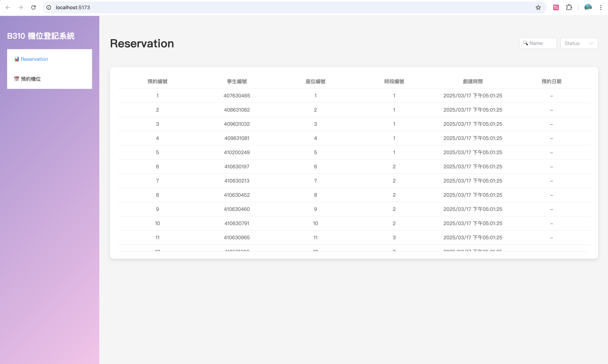

# B310 電腦教室機位登記系統前端
* 作業內容：使用前後端分離展示展示 Lab01 作業新增數據
* 我的後端 GitHub : https://github.com/Chun-Lin-Huang/mariadbDemo

## Lab01 頁面顯示結果

## 實現 Lab02 多日預約的功能
* 預約成功

* 預約成功可以到資料庫查看有沒有同時加入

💡 可以發現也有成功加入！

* 預約失敗

